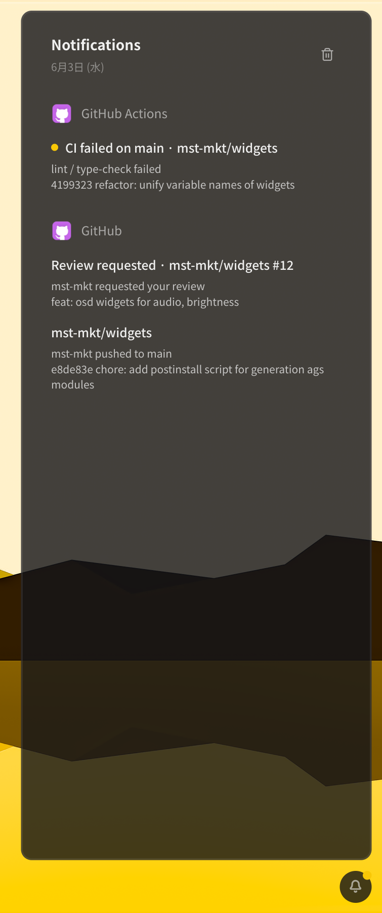
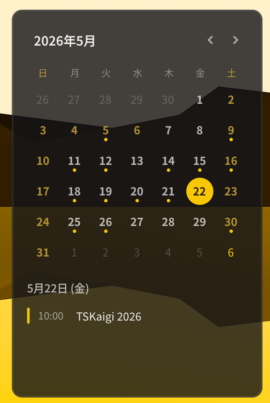
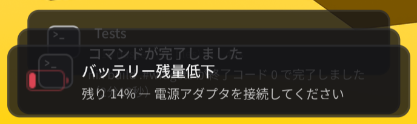
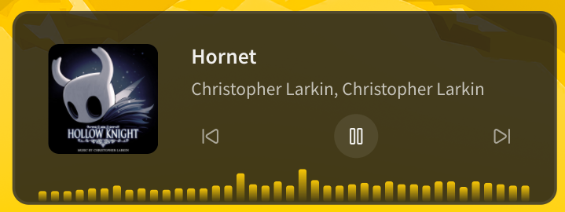
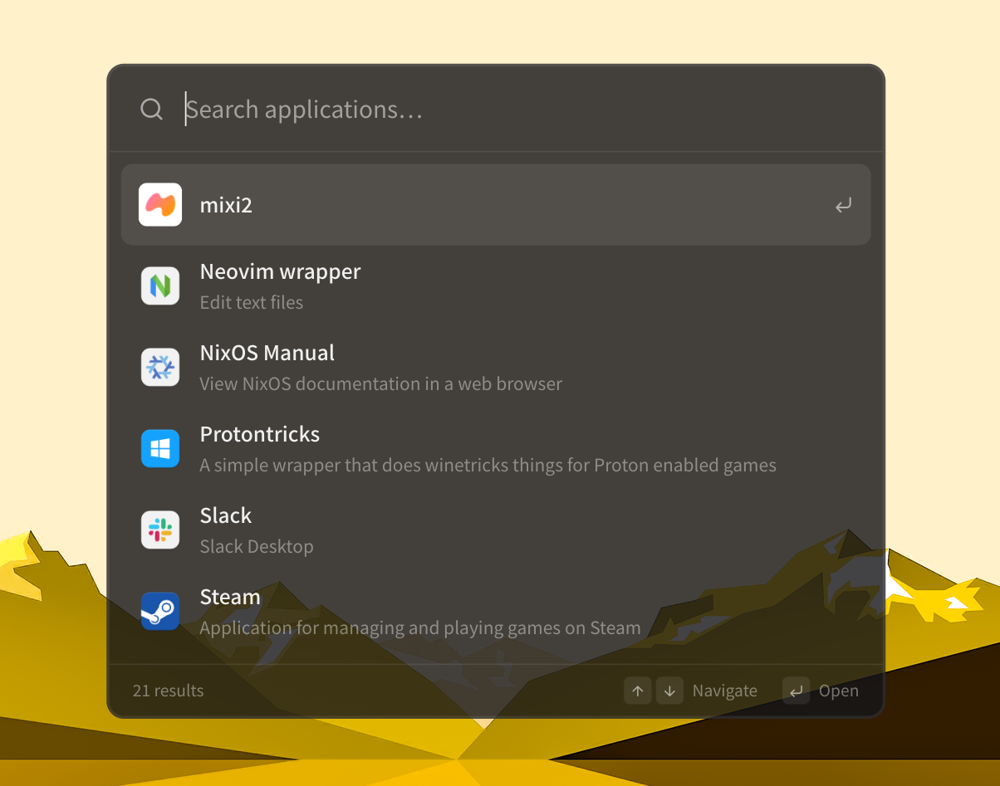

# mst-mkt/widgets

Linux Desktop widgets for [my laptop](https://github.com/mst-mkt/dotfiles), built with [Astal](https://github.com/aylur/astal) and [Gnim](https://github.com/aylur/gnim).

## Widgets

| Widget                 |                             Preview                             | Features                                                                                                   |
| ---------------------- | :-------------------------------------------------------------: | ---------------------------------------------------------------------------------------------------------- |
| **Bar**                |                  | <ul><li>Niri Workspace Indicator</li><li>Notification Panel Button</li><li>(Under construction…)</li></ul> |
| **Notification Panel** |  | <ul><li>Grouped notifications</li><li>Actions & dismiss</li></ul>                                          |
| **Calendar**           |            | <ul><li>Monthly Calendar</li><li>Japanese Holidays</li><li>Google Calendar Schedule</li></ul>              |
| **Notification Toast** |   | <ul><li>Sonner-style stacking popups</li><li>Hover to expand</li><li>Swipe & click to dismiss</li></ul>    |
| **Player**             |               | <ul><li>Track Info</li><li>Playback Controls</li><li>Audio Visualizer</li></ul>                            |
| **App Launcher**       |             | <ul><li>Fuzzy Application Search</li><li>Keyboard Navigation</li><li>Frequency-based Sorting</li></ul>     |
| **OSD**                |                  | <ul><li>Audio Volume</li><li>Screen Brightness</li></ul>                                                   |

_More widgets in development…_

## Usage

```sh
nix run github:mst-mkt/widgets
```

```nix
{
  inputs.widgets.url = "github:mst-mkt/widgets";
  home.packages = [ inputs.widgets.packages.${system}.default ];
}
```

### Request Handler

Widgets can be operated via the CLI.

- `widgets open {panelId}`
- `widgets toggle {panelId}`
- `widgets close`
